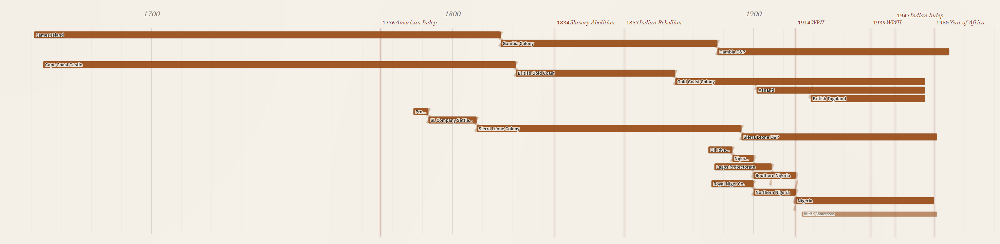
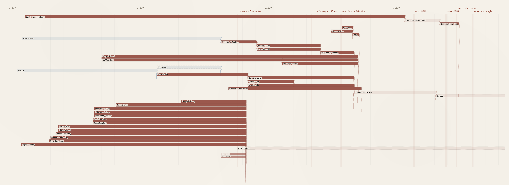
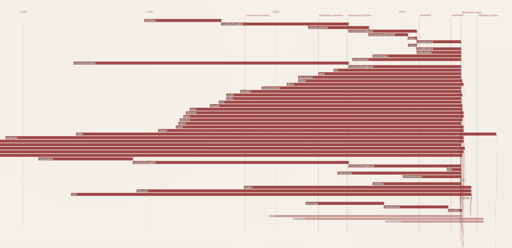

# Introduction

Historiography is cumulative: each new argument depends on prior scholarship that has already named, dated, and located the same actors and places. The structured datasets historians now produce should build upon each other in the same way. With coding agents making it much easier to create historical datasets, we need to reinforce linked open data conventions among computational historians to make our data interoperable going forward. The prerequisite is shared ground: agreement that two records describing "Victoria" or "Huizong" or "Demerara" describe the same entity. For prose scholarship, that ground is supplied by citation. For structured data, it has to be supplied by [persistent identifiers](https://en.wikipedia.org/wiki/Persistent_identifier). At the scale historical research now operates, [Wikidata](https://www.wikidata.org/wiki/Wikidata:Main_Page), with over 120 million items including millions of historical figures and places, is the only identifier system with sufficient coverage to play that role. This working paper describes the creation of a knowledge graph focused on the evolution of the British Empire between the sixteenth and twentieth centuries.

This dataset provides a foundation for a knowledge graph focused on the history of British imperialism and the British World System between the sixteenth and twentieth centuries. The goal was a database recording all of the colonies in any given year along with the evolution of individual colonies throughout their history. Most of this information already existed in Wikipedia and its linked open data project Wikidata. Working with Claude Code, I created a knowledge graph using Wikidata for persistent identifiers. Early in the project, however, it became clear that coding agents regularly hallucinated Wikidata QIDs, so the work required extensive human-in-the-loop verification. We found that developing a visualization helped with that verification by making it easy to see whether the colonies were linked together correctly. This paper will provide an overview of the iterative process to develop and check the knowledge graph using Claude Code.

This paper presents a Cypher property-graph dataset of **747 historical territories and 1,203 typed relationships**, together with an interactive Sankey visualization that makes the genealogies legible. Cypher is the query language used by graph databases such as Neo4j and FalkorDB; we chose a property-graph model over the more standards-bound RDF/SPARQL stack because relationships in a property graph can carry their own properties (a date, a source, a qualification), which matters when the relationship itself (a partition, a federation, an independence) is the historical object of interest, not just a link between two things. The dataset is a basic foundation, ready to be extended with additional data ranging from trade statistics to nodes for political officials or key events. The argument is larger: that knowledge graphs, with entities grounded to Wikidata QIDs, offer a productive *shared foundation* for historical research at this scale. Anyone who takes this data, builds on top of it, and shares the results contributes to a larger historical project. It allows us to do teamwork without forming teams.

# Wikidata grounding as a shared foundation

Computational history is now possible for individual scholars without grant-funded labs. Coding agents are empowering thousands of historians to build new datasets, but this risks a flourishing of data silos. If we all assign different unique identifiers to disambiguate Victoria the Queen from Victoria, British Columbia, we end up rebuilding the same disambiguation work in every project, and losing the chance for our datasets to compose into anything larger than themselves.

This is the problem linked open data was designed to solve. The idea is straightforward: if every dataset attaches the same persistent identifier to the same entity, then datasets compose. Wikidata has already done much of this work. The first page of results for "Victoria" disambiguates [the queen](https://www.wikidata.org/wiki/Q9439), [the British Columbian capital](https://www.wikidata.org/wiki/Q2132), [the Australian state](https://www.wikidata.org/wiki/Q36687), [the capital of the Seychelles](https://www.wikidata.org/wiki/Q3940), [a Roman goddess of victory](https://www.wikidata.org/wiki/Q308902), [a main-belt asteroid](https://www.wikidata.org/wiki/Q136930), [the Victoria and Albert Museum](https://www.wikidata.org/wiki/Q213322), and roughly a dozen others, each with a permanent identifier any historian's dataset can attach to.

Consider what this means in practice. A historian working on nineteenth-century Nova Scotia and a historian working on the East India Company army are unlikely to know each other's work. Their corpora are different, their archives are in different buildings, and their conferences do not overlap. But if both of them ground their data to [Q335381](https://www.wikidata.org/wiki/Q335381), George Ramsay, who served as Governor of Nova Scotia from 1816 and for Earl of Dalhousie, who served as Commander-in-Chief in India from 1830, their datasets join automatically. A query about Dalhousie's career can now reach across one historian's biographical work in Halifax archives and another's regimental records in Calcutta, without either of them having planned for the integration. The work that previously required weeks of reconciliation becomes a single query. The promise of computational history is not that everyone produces their own dataset. It is that many small datasets compose into a research commons larger than any of them.

There have been concerns in the digital humanities community about using Wikidata as scholarly infrastructure. Wikidata is crowdsourced; its data model is determined by its community of editors; some of its modeling decisions, of which the [handling of gender is the canonical case](http://academic.oup.com/ccc/article/17/3/200/7739141), have been incompatible with the priorities of researchers working on people whose lives the standard categories misrepresent. The response, in projects like LINCS (Linked Infrastructure for Networked Cultural Scholarship), was to build proper scholarly infrastructure with controlled vocabularies, considered ontological commitments, and editorial accountability. Those choices were correct, and I remain hesitant about building knowledge graphs on the Wikidata platform itself.

But the worry applies to *hosting* scholarship on Wikidata, treating Wikidata itself as the place where your scholarly conclusions live, where your data sits, and where your interpretations are subject to revision by anyone who edits the relevant pages. It does not apply to *grounding* scholarship to Wikidata, which is a different operation. LINCS already works this way. The graph LINCS publishes is its own linked open data, carefully modeled, with editorial accountability to the scholars who contribute to it. LINCS uses Wikidata QIDs directly as the identifiers for entities Wikidata already covers, and mints its own only when no alternative exists. The model is sovereign; the identifiers are shared. Computational historians can choose to invest in fully compliant CIDOC-CRM linked open data, or simple research spreadsheets. If we attach Wikidata identifiers to the entities in our data, we make our work interoperable with other projects. Anyone working on a related corpus, yours or someone else's, now or in twenty years, can join the two without asking permission, because the identifier is shared.

The reason this matters is that the alternative does not scale. No scholarly project, no matter how well-funded, can produce identifiers for over 120 million historical people, places, organisms, events, and concepts on its own. Wikidata has done that work. Its coverage is uneven and its modeling has problems, but it is the only system at the right scale for historical research as actually practiced. Ignoring it produces silos. Grounding to it, while keeping your own dataset, is the move that gets us out of this. A historian working on Bengal in 1850 and a historian working on Jamaica in 1840 do not need to coordinate, share infrastructure, or even know each other to produce datasets that interoperate. They need to use Wikidata identifiers for the people, places, and institutions in their sources. That is teamwork without a team. This is not a call for centralized infrastructure. It is the opposite. It is a call for a small set of shared conventions: use shared identifiers; ground to Wikidata; create new Wikidata entries when the substrate is thin. This lets individuals and small groups produce work that connects to a research commons without anyone having to build the commons explicitly. The commons is the consequence of the convention.

As the remainder of this working paper will demonstrate, the process is relatively easy and requires three basic commitments:

-   First, add Wikidata identifiers to the entities in your datasets. If you have a spreadsheet of historical figures, add a column for their Wikidata identifier.

-   Second, publish your data with the identifiers attached. A project website, a Zenodo deposit, a GitHub repository: the venue matters less than the principle that the identifiers are present and durable, so that someone reading your work in ten years can still find them.

-   Third, treat Wikidata-editing as part of historical practice. When you find that a colonial administrator, a rural township, or an eighteenth-century concept lacks an entry, contribute one with sources. We need to make this into an evolving standard of methodological rigor, on the same continuum as proper archival citation.

## The British Empire Evolution Knowledge Graph

This project started small and spiraled out of control. I was working testing LLMs ability to extract and ground information from Internet Archive documents related to the British Empire in the nineteenth century. It occurred to me I should start with a foundational dataset with all of the colonies. I asked a coding agent to help me create a knowledge graph with all of the colonies in the late nineteenth century. It quickly produced a graph that covered a lot of the empire, but was riddled with errors. So the project snowballed as I tried to figure out how to improve accuracy and extend the scope to include the full overseas empire. Wikidata was an obvious starting place. I knew from the Trading Consequences project (2012-2016) that Geonames does not include many of the historical geographical entities such as Rupert's Land or the Oil Rivers Protectorate. Wikidata, in contrast, has all of these entities as it is linked to Wikipedia articles. Most British colonies have a Wikipedia entry and a Wikidata ID: <https://en.wikipedia.org/wiki/Niger_Coast_Protectorate> and <https://www.wikidata.org/wiki/Q2566427>. Wikidata also has entries for minor princely states without an English language Wikipedia page, such as Dedhrota (<https://www.wikidata.org/wiki/Q131126101>). Working with Claude Code, I tried to identify and ground all of the British colonies in Wikidata and develop them into a knowledge graph using Neo4j as the graph engine. The project grew to include colonies starting with the Crown of Ireland Act of 1541 and the founding of Virginia in 1607. The project was iterative as I identified errors and worked with Claude to develop plans to verify the data. I realized I needed to be able to see the colonies and the temporal relationships between colonies as they merged, split or gained independence. This pushed me to develop a visualization to make the data easier to follow and correct.

The visualization needed to track change over time and show the chain of relationships as smaller coastal colonies merged and evolved into larger colonies, as was the case in West Africa.



The visualization proved important in correctly mapping out the colonial history of what became Canada, capturing the conquest of the French Empire, the division and later merger of Upper and Lower Canada, and the shorter history of two colonies forming into one before joining confederation in British Columbia.



South Asia created unique challenges hundreds of princely states, including many that predated Britain's overseas empire; I decided to select a geographically diverse sample of these states in the visualization while including all of them in the underlying knowledge graph. The South Asia section highlights a limit in this visualization, where screen space and data limitations meant every colony is represented by the same width of bar; the Bombay Presidency is represented the same as the Factory at Surat despite their different scale and levels of colonial control. We could use population estimates or number of square km to differentiate between the major colonies and minor trade forts, but that would require data for each colony and a way to represent change over time. The current visualization prioritizes identifying all of the colonies, their time span and how they relate over visualizing the social, political or economic significance of the different colonies.



The iterative process continued after completing the visualization. I needed to ensure all of the Wikidata QIDs matched the colonies. Most of them were reviewed in an earlier human in the loop process. I used Claude Code to create an HTML website that pulled the description from Wikidata and presented it alongside the colony name. I then either verified or provided an alternative. As we worked through the list, we found some minor island colonies did not have a Wikidata ID for the colonial period, so we decided to use the ID for the geographical islands. We also found a few colonies not included in Wikidata and had to decide whether the current political entity could be used as a stand in. In a final process, we used Claude to search every row in the knowledge graph to ensure the Wikidata ID matched and it found a small number of errors. We completed a human review of these errors and published the final version with notes attached for all of the colonies where we had to use a geographical entity, the modern political entity, or a broader Wikidata entity that spans multiple sub-periods of colonial administration, in place of a unique Wikidata ID for the colony. We are now considering adding these entities into Wikidata as a contribution to that project and to make our knowledge graph more consistent.

## Property graphs in historical research

The choice to model in Cypher places this dataset within a small but growing tradition of historical and digital-humanities projects that have made the same call. Christopher Warren and colleagues built *Six Degrees of Francis Bacon* [@warren2016sixdegrees] on a property graph of roughly 13,000 early-modern persons and 200,000 typed relationships (PARTNER_OF, LETTER_TO, TRANSLATED, LIT_CRIT_ON), and documented an evolution from storing relationships as properties of nodes to adding dedicated nodes and labels as their research questions matured. The same model has been applied across very different historical subfields, including Roman prosopography [@vargabornhofen2024romans], network analyses of postwar reparations activism [@pan2022networking], and medieval Korean kinship and patronage networks [@cha2026macroscope]. Jon MacKay's [-@mackay2018programminghistorian] *Programming Historian* tutorial, built around the 1912 Canadian corporate-interlock directorates, has made Cypher part of the field's pedagogical apparatus.

What unites these projects is not a vendor preference but a recurring set of fits between the property-graph model and the work historians actually do. Edges that carry their own properties let scholars annotate ties with dates, sources, and qualifications without distorting the schema around them. Questions that follow a chain of relationships across many steps, such as a political succession from colony to independent state to federation, or a kinship descent across generations, can be asked of the database in a single query rather than reconstructed step by step from many smaller ones. And because the schema can evolve as the source material is better understood, the model does not require committing to an ontology before the research question is fully formed, which fits the iterative way historical understanding actually develops.

Where the field is still thin is in published humanist work on GraphRAG, the LLM-augmented retrieval pattern that uses a knowledge graph as both context for and constraint on generation. Computer-science work on GraphRAG has accelerated through 2024 and 2025 [@edge2024graphrag; @han2025graphrag], and cultural-heritage-adjacent applications have begun to appear, but a flagship humanist-authored study of GraphRAG on historical archives has not yet been published. This is an opening rather than a settled question. Property-graph datasets like this one are well-positioned for that work when historians take it up, and the present paper is intended in part as a substrate that GraphRAG-oriented research can attach to.

## Why not CIDOC-CRM?

The most considered alternative to a project-specific property-graph model would have been to publish the dataset as RDF following CIDOC-CRM, the ISO-standard ontology for cultural heritage and the most widely adopted shared ontology in the digital-humanities linked-data world. CIDOC-CRM is well documented, carefully designed, and built for exactly the kind of cross-project interoperability we argue for elsewhere in this paper. It is reasonable to ask why we did not use it.

The honest answer begins with a problem that historical-GIS practitioners know well: most of the colonies in this dataset do not have a stable territorial extent. A useful test question is to ask what the spatial node would be for "Canada" in 1770, 1841, 1867, and 1951. There is no single answer. In 1770 there is no Canada; the territory along the St. Lawrence is the Province of Quebec under British military rule. In 1841 the Act of Union has merged Upper and Lower Canada into the Province of Canada. In 1867 the Dominion of Canada is four provinces along the St. Lawrence and the lower Great Lakes. By 1951 it is a transcontinental federation that has recently absorbed Newfoundland. CIDOC-CRM handles this correctly through E93 Presence (the published documentation uses the Roman Empire as exactly this kind of example), where each territorial configuration is its own spatiotemporal node attached to a persistent E74 Group via P166_was_a_presence_of, with its own E52 Time-Span and E94 Spatial Primitive. The model is right. It is also a model in which a single polity's territorial life is not one node but a sequence, and the dataset's 747 territories would expand into a much larger graph of presences, time-spans, geometries, and labels. The CIDOC-CRM-compliant version of post-confederation Canada alone is at least eight E93 Presences (1867, 1870, 1871, 1873, 1898, 1905, 1949, 1999), each with its own provenance and geometry, before any partition or accession event has been added to the graph.

The deeper friction is at the edges. CIDOC-CRM has no direct property for "partitioned into," "merged into," "federated with," or "became independent." All of these are modeled as E81 Transformation events with `P124_transformed` pointing to the input persistent item and `P123_resulted_in` pointing to each output, alongside E66 Formation and E68 Dissolution events for entry into and exit from existence. The partition / merger / federation / succession distinction is recoverable through `P2_has_type` on each E81, but the typed-edge semantics that make Cypher queries legible (`[:PARTITIONED_INTO|:FEDERATED_INTO|:EVOLVED_INTO*]`) have to be reconstructed through pattern queries that traverse intervening event nodes. For a dataset whose primary contribution is the queryable genealogy itself, this is a real ergonomic loss with no offsetting gain in expressiveness.

What this placement gives up is worth naming. Joining a CIDOC-CRM-compliant triplestore would have meant that a single federated SPARQL query could in principle compose our dataset with LINCS, with the British Museum's collections, and with any other historical project that has done the same modeling work. That kind of seamless cross-project composition was the original promise of linked open data, and a property-graph project grounded only at the identifier layer cannot offer it. Anyone who wants to combine our data with another project's has to do that combination project by project, attaching at the QID layer, rather than asking a single endpoint a single question.

Whether that cost is as decisive in 2026 as it would have been a decade ago is an open question. Large language models have changed what cross-project synthesis looks like in practice: a research question posed in natural language can be translated into Cypher against our graph, SPARQL against a triplestore, and REST against a third source, with the results reconciled by the model. This is more flexible than federated SPARQL, since no schema agreement is required upfront, and also less verifiable, since the reconciliation is opaque and can fail silently. The tension cuts two ways. If LLMs can bridge schemas at query time, the up-front cost of committing to a shared ontology may matter less than it did. If LLM-mediated answers can fail silently, the verifiability a properly modelled ontology offers may matter more, not less. I do not have a settled view on which way this pulls, and I am not aware of digital-humanities scholarship that has worked the question through directly. We need to test this in practice, and the present paper is intended as a contribution to that testing by making both options available to the field. The choice is not between RDF and property graphs; it is between RDF and property graphs *for this project*. Both are viable options for historical research, and both have their place in the ecosystem.

The decision is therefore not a rejection of CIDOC-CRM but a placement of it. CIDOC-CRM is the right tool for the artifact-and-person scale of cultural heritage cataloging, where the event is itself the historical object of interest: an acquisition, an attribution, a production. It is also the right tool for projects whose primary deliverable is a richly time-scoped historical GIS, where E93 Presences and E94 geometries do exactly the work the data needs and the cost of the event scaffolding is repaid by the queries the geometry makes possible. Each project needs to consider the costs and benefits of choosing different approaches. For a foundational political-territorial history knowledge graph at the level of polities and successions, where the dataset's value is in the typed relationships between persistent entities rather than in the geometries themselves, the presence and event nodes are scaffolding around the relationships historians actually want to query. We chose to keep the working model flexible and to do the cross-project work at the identifier layer instead, by attaching Wikidata QIDs to every territory and flagging the ones we could not ground. The choice is one of placement, and treating it as such is what keeps both options open to the field.

A hybrid path is also available, and the European Holocaust Research Infrastructure (EHRI) is the clearest worked example. EHRI's underlying portal store is Neo4j, while EHRI-KG [@garciagonzalez2023ehri] exposes the same archival material as RDF aligned to RiC-O and schema.org for downstream linked-data consumption. The working model is a property graph optimized for curation and query; RDF is generated as a publication layer when interoperability with the linked-data ecosystem matters. The architecture this paper proposes (model in a property graph, ground at the Wikidata identifier layer) is a lighter-weight version of the same pattern, and EHRI's experience suggests that historians who want both can have both.

### Schema

The graph uses a small, deliberately constrained vocabulary of node labels and relationship types. Every territory carries the base label `:HistoricalTerritory`, which lets pattern queries that should apply to all polities (lineage traversals, date filters, regional groupings) work uniformly. Each territory also carries one or more specific subtypes drawn from a controlled list: `:Colony`, `:CrownColony`, `:Protectorate`, `:Dominion`, `:Mandate`, `:PrincelyState`, `:Federation`, and `:IndependentNation`. Multiple labels are permitted, so that a territory which began as a colony and became a dominion carries both, with the transition encoded in the relationship that links the earlier and later configurations. Queries can then ask either the polity-shape question ("which dominions existed in 1925?") or the lineage question ("trace this territory's status changes over time") without rewriting.

A small set of relationship types does most of the work: `:EVOLVED_INTO`, `:PARTITIONED_INTO`, `:MERGED_INTO`, `:FEDERATED_INTO`, `:BECAME_INDEPENDENT`, `:ADMINISTERED_UNDER`, and `:PART_OF`. The distinctions matter historically. A partition (`:PARTITIONED_INTO`) is one entity becoming several, as when British India became India and Pakistan in 1947. A merger (`:MERGED_INTO`) is several entities becoming one, as when Upper and Lower Canada merged into the Province of Canada in 1841. A federation (`:FEDERATED_INTO`) is several entities joining a new larger entity without ceasing to exist themselves, as when the four founding provinces formed the Dominion of Canada in 1867. An evolution (`:EVOLVED_INTO`) is one entity becoming the next configuration of itself with continuous legal personality. Independence (`:BECAME_INDEPENDENT`) marks the transition from colonial to sovereign status. Administration (`:ADMINISTERED_UNDER`) captures concurrent governance arrangements where one entity is run from another without being absorbed by it. `:PART_OF` captures spatial inclusion. Each edge carries at least a `year` property, and many also carry `source` and `note` properties that document the assertion.

The discipline of restraint matters here, and it is worth being explicit about why. Property graphs let a curator create any relationship type at any time. There is no schema validation forcing edge types to be declared in advance, and no warning if a new one is introduced by typo. That freedom is appealing in early modelling, when the right distinctions are not yet clear, but the cost shows up later in querying. A pattern like `[:PARTITIONED_INTO|:FEDERATED_INTO|:EVOLVED_INTO*]` only returns the right answers if those three relationship types are used consistently across the entire dataset. If half the partitions are encoded as `:PARTITIONED_INTO` and the other half as `:SPLIT_INTO` or `:DIVIDED_INTO`, the query silently returns the wrong results, and the wrongness is invisible because no error is raised. The discipline that produces a queryable graph is restraint: keep the relationship-type vocabulary as small as the work allows, audit the graph periodically for typos and near-synonyms, and treat adding a new edge type as a methodological decision rather than a casual choice. The temptation to add `:DEVOLVED_FROM`, `:SECEDED_FROM`, `:GAINED_DOMINION_STATUS`, and so on was resisted in this project in favour of using the existing seven types with edge properties where a finer distinction was needed.

The honest comparison with RDF is that OWL pushes a project toward schema declarations early. That feels heavy and constrains exploration, but it catches inconsistency mechanically. Property graphs feel light and let a model evolve as the source material is better understood, but the curator becomes the schema's only enforcer. Both choices are defensible. Historians adopting the property-graph model for their own work should know they are signing up for the second deal.

# Future work

This paper is the first in a planned series. A second paper documents the use of the Wikidata MCP server to ground entities at scale, including the disambiguation patterns that worked, the ones that didn't, and the verification workflow that kept hallucinated QIDs out of the graph. A third, longer paper extends the territorial scaffolding presented here into a much larger knowledge graph built from the *Colonial Office List* for the period 1867 to 1968, populating the colonies with the personnel, offices, appointments, and administrative arrangements that actually ran them. Each paper builds on the convention argued for above: ground to Wikidata, keep your own model, publish so others can join. The graph in this paper is intended as a substrate the later work can attach to, and as an invitation to anyone whose corpus would compose with it.

The dataset is also a natural candidate for extension to the other European empires of the same period: French, Spanish, Portuguese, Dutch, Belgian, German, and Italian. Beyond Europe, the same modelling approach could be extended to non-European political entities whose territorial histories are entangled with the imperial frame the British graph currently centres. Each of those extensions would benefit from the same Wikidata-grounded approach, and each would compose with the present graph automatically wherever the QID layer is shared.

## A note on what a graph of imperial territories cannot represent

A more serious limitation concerns the kinds of sovereignty a graph of empires represents and the kinds it cannot. Modelling Indigenous nations in linked open data bumps against the OCAP principles of Indigenous data ownership, control, access, and possession, and global-history projects need to be careful about what they assert in a knowledge graph, particularly around sovereignty. The graph in this paper records British imperial claims to territory; it does not record who actually exercised authority on the ground. Rupert's Land, for example, is included as a node because the Hudson's Bay Company held a legal charter to it, but the company did not exercise the wide territorial control or monopoly of violence characteristic of a settler colony, and large parts of the chartered area remained under Indigenous governance throughout the HBC period. Likewise, the formal expansion of Canada in the 1870s to incorporate British Columbia and the North-West Territories is encoded in the graph as a federation and a series of accessions, but the inclusion of these transitions is not an endorsement of Canadian claims to unceded lands, nor of treaty processes whose Indigenous signatories did not understand themselves to be surrendering sovereignty. The graph is a record of one set of claims and should be read alongside scholarship that takes Indigenous sovereignty as its starting point.

# Code and data availability

The dataset, visualization, and loading scripts are openly available at <https://github.com/jburnford/empire-evolution-wpcs>. The repository contains:

- `data/britishempire_kg_export.cypher` — the full graph: 747 historical territories (314 colonial polities and 433 princely states) and 1,203 typed relationships, exported from Neo4j.
- `data/qid_manifest.tsv` — every territory with its Wikidata QID and, where applicable, the scope note documenting which stand-in entity was used and why.
- `viz/empire_evolution.html` — the self-contained D3.js Sankey visualization shown in the figures above. The data is embedded in the HTML; open the file in any browser.
- `scripts/load_falkordb.py` — an in-process loader for [FalkorDB](https://www.falkordb.com/) (no Neo4j server, no Docker, no Java required).
- `notebooks/quick_tour.ipynb` — a guided tour with three pyvis subgraph visualizations (schema-level statistics, the Canada lineage tree, and the Southeast Asia regional subgraph).

The dataset and code are released under CC-BY 4.0.

## Loading the graph

The lightest-weight option is the embedded FalkorDB loader, which spins up a graph in-process and drops the user into a Cypher REPL:

``` bash
pip install -r requirements.txt
python3 scripts/load_falkordb.py --interactive
```

For a full Neo4j installation, the same export loads with `cypher-shell`:

``` bash
cypher-shell -u neo4j -p <password> -f data/britishempire_kg_export.cypher
```

Neo4j 5.x is recommended. Re-running the script is idempotent.

## Sample queries

Settlements that became independent through partition:

``` cypher
MATCH (a:HistoricalTerritory)-[:PARTITIONED_INTO]->(b:HistoricalTerritory)
WHERE 'IndependentNation' IN labels(b)
RETURN a.canonical_name, b.canonical_name, b.established_year
ORDER BY b.established_year;
```

Lineage of any territory back to its earliest predecessor:

``` cypher
MATCH path = (root:HistoricalTerritory)-[:EVOLVED_INTO|:PARTITIONED_INTO|:MERGED_INTO*]->
  (target:HistoricalTerritory {canonical_name: 'Dominion of Canada'})
WHERE NOT (()-[:EVOLVED_INTO|:PARTITIONED_INTO|:MERGED_INTO]->(root))
RETURN path;
```

# References {.unnumbered}

::: {#refs}
:::